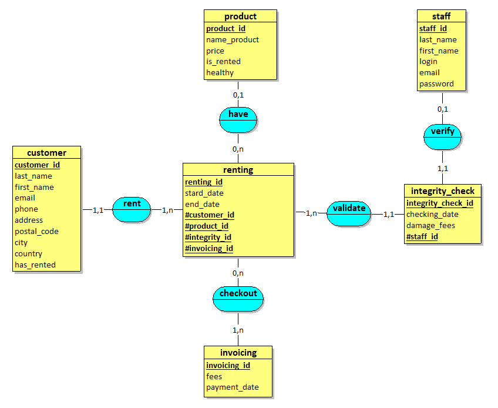

# Unicorn Location

This project is a web application that allows our customers to rent a unicorn.
Every unicorns are available for every kind of customers.

#### Application Permineter

#### Application's Functionalities

In this application, staff members will be able to manage users, products and renting for customers who will come to our agency. 
You can see these functionalities in the use case below: 

#### Application Models
In order to define our database models, we first created a MLD

Then, we conceived a class diagram
